 

 

 

<table>
<tr>
<td width="240" align="center" valign="middle">
  
</td>
<td valign="middle">

### Hi, I'm Durai

I build **websites and ordering systems for local businesses** in Madurai and across Tamil Nadu.

If you run a shop, a salon, a food business or a small service and want customers to **find you, order from you and book you online**, that is exactly what I build. Every site is mobile friendly, fast, and comes with a simple **owner dashboard** so you can manage things without any technical knowledge.

I also communicate in **Tamil and English**, so you can explain your business in the language you are most comfortable with.

</td>
</tr>
</table>

---

## What I Build For You

| | Service | What you get |
|---|---|---|
| 🌐 | **Business Website** | A clean, professional site that shows your products, services, prices and location |
| 🛒 | **Online Ordering System** | Customers browse, add to cart and place orders. Orders reach you directly |
| 📅 | **Booking Website** | Customers pick a service and book an appointment online |
| 📊 | **Owner Dashboard** | See and manage orders or bookings in one place, no coding needed |
| 🚀 | **Hosting & Launch** | I deploy your site live on the internet so you can share the link right away |
| 📱 | **Mobile First Design** | Most customers visit from their phone, so every site is built for small screens first |

---

## Live Projects

Real websites built for real local businesses. Open them and try them yourself.

<table>
<tr>
<td width="50%" valign="top">

### 💄 Sneha's Makeover
**Bridal makeup booking website**

Service showcase, appointment booking and an owner dashboard.

`Booking flow` `Owner dashboard` `Mobile first`

[**View Live Website →**](https://duraiartist-dev.github.io/snehas-makeover/)

</td>
<td width="50%" valign="top">

### 🎆 Sri Sivamurugan Crackers
**Product catalogue and ordering website**

Customers browse the full catalogue and place orders. The owner manages them.

`Product catalogue` `Customer orders` `Owner dashboard`

[**View Live Website →**](https://duraiartist-dev.github.io/sivamurugan-crackers/)

</td>
</tr>
<tr>
<td width="50%" valign="top">

### 🍿 Preethi Snacks
**Snack business ordering website**

Product browsing, ordering and business management features.

`Product display` `Ordering workflow` `Management`

[**View Live Website →**](https://duraiartist-dev.github.io/preethi-snacks/)

</td>
<td width="50%" valign="top">

### 🎨 Durai Arts
**My own portfolio website**

Designed and built from scratch to present my pencil portrait work.

`Portfolio` `Creative design` `Personal brand`

[**View Live Website →**](https://duraiartist-dev.github.io/DURAI_ARTS/)

</td>
</tr>
</table>

---

## How We Work Together

| 1️⃣ Discuss | 2️⃣ Design | 3️⃣ Build | 4️⃣ Launch |
|:---:|:---:|:---:|:---:|
| You tell me about your business and what you need | I plan the pages and show you the look | I build the site and you review it with me | I put it live and make sure it works |

---

## Why Work With Me

- **Practical, not complicated.** I build what your business actually needs, nothing extra.
- **Real projects you can open.** My work is live, so you can judge it before you decide.
- **Attention to detail.** As a pencil portrait artist, I am used to patient, careful work. The same care goes into every page I build.
- **Easy communication.** Tamil or English, simple language, regular updates.
- **I keep learning.** Currently deepening my Python and software skills to build smarter tools for businesses.

---

## Tech Stack

 

---

## Beyond Code

Outside of web development, I am a **pencil portrait artist** and a **National Level Art Contest winner** (Season 18, consolation prize). See my art on [Instagram @tn58_art_journey](https://www.instagram.com/tn58_art_journey/) and in my [art portfolio](https://duraiartist-dev.github.io/DURAI_ARTS/).

---

## Let's Build Your Website

### Have a business that needs to be online? Let's talk.

<!--
Uncomment and edit these lines after adding your own details:

-->

  

*Madurai, Tamil Nadu, India*

